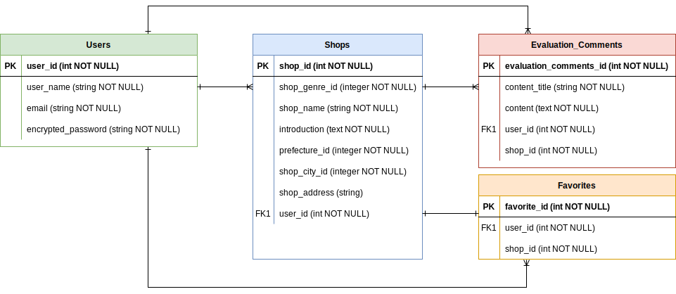

## アプリケーション名

OSAKA WALKER

## アプリケーション概要

大阪に限定した衣食住に関するショップをシェアしたり検索することが出来るアプリ。  
ショップのクチコミを投稿することができ、他者のクチコミも閲覧できる。

## URL

https://osakawalker.herokuapp.com/

## テスト用アカウント

- Basic認証ユーザー名：112277
- Basic認証パスワード：112277
- メールアドレス：test@test.com
- パスワード：test1227

## 利用方法

### ショップの投稿

1.トップページ（一覧ページ）のヘッダーからユーザー新規登録を行う  
  
2.NewShopボタンからショップの内容（画像・店ジャンル・ショップ名・説明・所在地）を入力し投稿する  
  

### 口コミを投稿する

1.ショップ一覧ページのショップ名をクリックし、ショップ詳細ページに移る  
  

2.ショップ詳細ページの下部分にある口コミ投稿ボタンから口コミ内容を入力し投稿すると更に下のクチコミ一覧に反映される  
  

### ショップを検索する

1.トップページの検索窓で任意のショップ名を入力  
2.条件に引っかかるショップを一覧表示する  
  

## アプリケーションを作成した背景

普段から休日に家族や友人などとランチに行く際、場所に悩む時間があった。  
これまではインターネットやインスタグラム等のSNSで検索してお店を探していたが、同じお店が複数ヒットしたり口コミがまとめて表示されないことから、お店を決めるのに時間がかかっていた。  
ランチ以外で洋服や家具を探す際にも同様に悩むことが多く、友人に聞くと同じような悩みがあることを知り、一定数同じ悩みを持つ人がいるのではないかと仮説を立てた。  
家族時間や友人とのランチ、デートなどお洒落なお店に行きたいと思った際に、悩む時間を少しでも軽減できればと思い開発することにした。

## 洗い出した要件

[要件定義シート](https://docs.google.com/spreadsheets/d/1zs7lwFkzWQT5GHFKyq5ZmdqEJGZRQ1bsxOiiUoPGVPc/edit#gid=982722306)

## 実装予定の機能

お気に入り機能を実装中。  
その後は複数画像をスライドで表示機能、地域検索機能を実装予定。  

## データベース設計

## 画面遷移図

## 開発環境

- フロントエンド：HTML・CSS・Javascript
- バックエンド：Ruby・Ruby on Rails
- インフラ：heroku・AWS
- テスト：Rspec
- テキストエディタ：Visual Studio Code
- タスク管理：Github